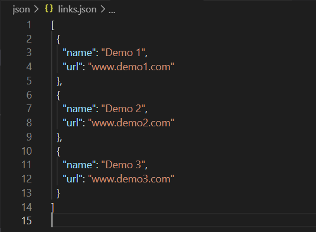

## Create Your Own !

<h2>
<ul>
<li>Star this Repository ( Optional )</li>
<li>Fork this Repository. </li>
<li>Clone this repositoy. </li>
<li>Edit the `index.html` file with your information.</li>
<li>Edit the `links.json` file with your links and respective names ( Note :- Keep in mind that links.json file is Javascript object so syntax of object must be same )</li>
<li>You can add as many as link with name and url.</li>
</ul>
</h2>

# `links.json` File Syntax:

 

# Desktop / Laptop View

 

 

# Tablet View

 

 

# Mobile View

 

